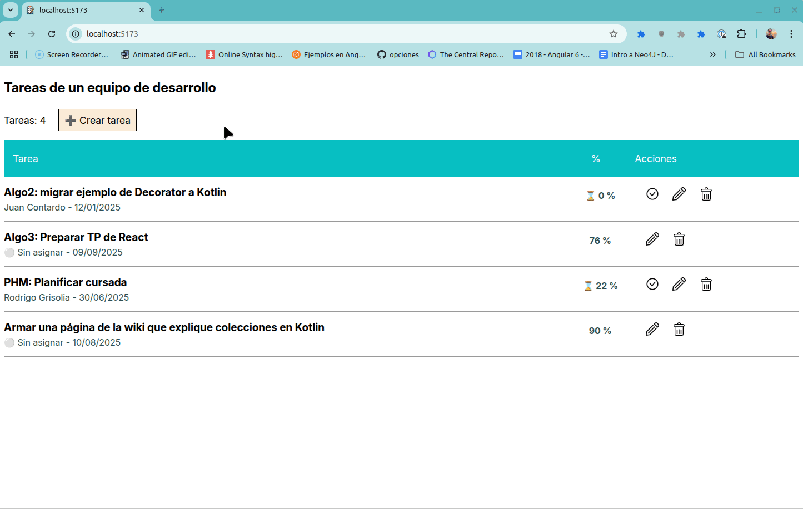
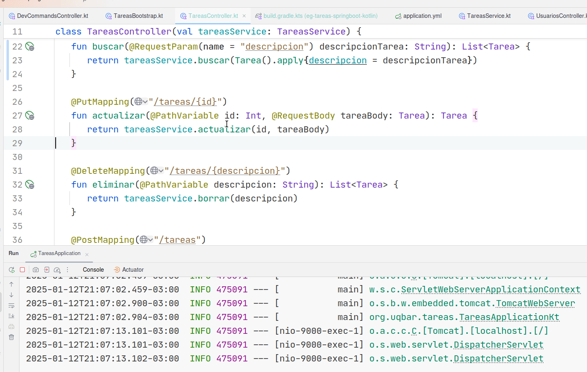
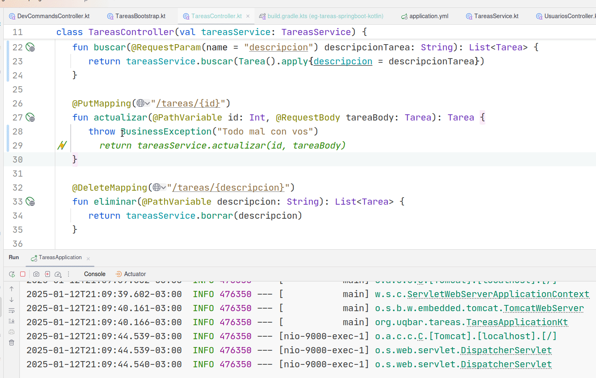

## Tareas de un equipo de desarrollo

[](https://github.com/uqbar-project/eg-tareas-svelte/actions/workflows/build.yml) [](https://codecov.io/gh/uqbar-project/eg-tareas-svelte)



Este ejemplo muestra

- la interacción con un backend, incluyendo el manejo de errores
- cómo se modela un formulario con validaciones
- la navegación de una página principal a una donde se toma información del backend

## Llamadas a un backend

Para buscar las tareas, los usuarios y para enviar las actualizaciones, el backend sirve como fuente de verdad (single source of truth) entre sesiones. Por ejemplo, para buscar todas las tareas disponibles, hacemos un llamado a un web server mediante una API REST, a un método GET de http que nos devuelve un JSON. Como sabemos que es una operación que puede tardar y no podemos bloquear el thread del event loop, la trabajamos en forma asincrónica. En el componente Svelte hacemos:

```svelte
let tareas = $state<Tarea[]>([])
const buscarTareas = async () => {
  tareas = await tareaService.todasLasTareas()
}

buscarTareas()
```

Cuando el service complete su búsqueda se produce el binding con el estado `tareas` lo cual fuerza el render de la página (pueden ver cómo está implementada). 

El service hace la llamada mediante `axios`:

```ts
async todasLasTareas() {
  const queryTareas = () => axios.get<TareaJSON[]>(REST_SERVER_URL + '/tareas')
  return (await getAxiosData(queryTareas)).map(Tarea.fromJson)
}
```

También hay una decisión de diseño de convertir el JSON a un **objeto de dominio** Tarea, al cual le podemos preguntar si se puede cumplir, si se puede asignar, etc.

Ésto es útil en la página principal, para por ejemplo mostrar el porcentaje de cumplimiento de la tarea: 

```svelte
<div class="porcentaje" data-testid={'porcentaje_' + tarea.id}>
  {tarea.estaCumplida()
    ? '✅'
    : (tarea.cumplioMenosDe(50) ? '⌛ ' : '') + tarea.porcentajeCumplimiento + ' %'}
</div>
```

La función `getAxiosData` simplemente wrappea la respuesta y rechaza la promesa si recibe un status != 200 (habría que chequear casos de códigos http como 201, 302, etc.)

```ts
export const getAxiosData = async <T>(query: () => Promise<AxiosResponse<T>>): Promise<T> => {
  const response = await query()
  if (response.status !== 200) {
    // eslint-disable-next-line no-console
    console.error(response)
    throw new Error((response as unknown as { message: string }).message || 'Error al llamar al backend')
  }
  return response.data
}
```

## Errores

### Errores de negocio



### Errores de sistema



### Manejo de errores

En nuestra aplicación cada llamada al backend se encierra en un bloque try/catch, en el **componente Svelte** que es quien sabe tratar los errores: no es el service que solo debe rechazar la promesa. Cuando recibimos un error es importante diferenciar

- errores de negocio: debemos mostrar el mensaje de error que recibimos (en el atributo message)
- vs. errores de sistema: el error es importante para las personas que desarrollan, no para el usuario. El mensaje que mostramos es general.

El tratamiento de errores se hace en una función específica:

```ts
export const getErrorMessage = (error: any): string => {
  if (error.response && error.response.data) {
    return error.response.data.status < 500 ? error.response.data.message : 'Ocurrió un error, consulte al administrador del sistema.'
  } else if (error.message) {
    return error.message
  } else {
    return 'Error desconocido'
  }
}
```

El componente llama a esta función que muestra un **toast**:

```svelte
const cumplir = async (tarea: Tarea) => {
  try {
    tarea.cumplir()
    await tareaService.actualizarTarea(tarea)
    await buscarTareas()
  } catch (error: unknown) {
    showError('Error al cumplir la tarea', error)
    await buscarTareas()
  }
}
```

`showError` está definido en `errorHandler` y es una función que le aplica estilos al mensaje de error. Pueden ver su implementación.

## Validación de errores

El objeto de dominio Tarea al validar genera una lista de campos inválidos, lo que permite mostrarlo en forma cómoda al usuario. Para ello creamos un componente de Svelte que se asocia a cada campo con error. Para más información pueden ver [`ValidationField.svelte`](./src/lib/components/ValidationField.svelte) y [`tarea.ts`](./src/lib/domain/tarea.ts), el método validar.

## Routing

Tenemos dos rutas principales:

- `/`: la página principal que muestra las tareas
- `/tarea/[tareaId]`: la que te lleva a una nueva tarea, cuando tareaId = `nueva` y la que permite editarla si tareaId es un número

El routing se hace client-side, por eso la segunda ruta tiene un archivo `+page.ts` (y no `+page.server.ts`). Allí recibimos el id de la tarea y si corresponde vamos a buscar el objeto Tarea para pasarla a la página Svelte. Como es CSR, podemos trabajar con un objeto de dominio Tarea con métodos y no nos obligan a usar un JSON:

```ts
export async function load({ params }) {
  try {
    const nuevaTarea = params.tareaId === 'nueva'
    const tarea = nuevaTarea ? 
      new Tarea() :
      await tareaService.getTareaById(+params.tareaId)
    const asignatarios = await usuarioService.getAsignatarios()
    return { tarea, asignatarios, nuevaTarea }
  } catch (error: unknown) {
    // eslint-disable-next-line no-console
    console.error('Error al cargar la tarea:', error)
    throw redirect(302, '/')
  }
}
```

Un detalle adicional es que la tarea que pasamos como props garantiza no ser undefined, en caso contrario disparamos un redirect hacia la página principal (podés testear qué sucede si hacemos `localhost:5173/tarea/271578230`)

## Tests

Este ejemplo viene con

- tests unitarios
- tests de frontend
- tests e2e

### Tests unitarios

Tanto tarea como usuario son objetos que tienen comportamiento, por lo que tenemos una buena cobertura de tests, similares a los que vieron en materias anteriores.

```bash
src/lib/domain             |     100 |       96 |     100 |     100 |                   
 errorHandler.ts           |     100 |      100 |     100 |     100 |                   
 tarea.ts                  |     100 |     97.5 |     100 |     100 | 50                
 usuario.ts                |     100 |    66.66 |     100 |     100 | 8    
```

Podés verlos, tanto para las [tareas](./src/lib/domain/tarea.spec.ts) como para el [error handler](./src/lib/domain/errorHandler.spec.ts).

### Tests de frontend

Aquí tenemos algunas cosas interesantes, como por ejemplo el momento de testear la navegación a la página de creación de una tarea. En el caso de la página Svelte, vamos a recibir la tarea nueva como parámetro pero además queremos probar la interacción de toda nuestra UI:

- tipeamos la descripción
- también la iteración
- seleccionamos un usuario para asignarle la tarea
- marcamos el % de cumplimiento
- le asignamos una fecha
- en el test necesitamos darle tiempo a que ocurra el binding, por eso aparece el método asincrónico `tick()`
- y presionamos el botón Cumplir. 

Aquí otra decisión de diseño es **incluir al service de la tarea** dentro de la cobertura, por eso en lugar de mockear tareaService, simulamos la respuesta de axios. Eso requiere que primero escribamos la respuesta que vamos a querer y **luego hagamos el import**. Por último, lo que esperamos es que la llamada a axios sea un método HTTP put con un JSON específico: eso es lo que estamos testeando. Vemos cómo se implementa:

```ts
it('si la tarea está ok al hacer click en el botón "Guardar" debe enviarla al backend', async () => {
  const asignatario = new Usuario('Fernando')
  const tarea = Object.assign(new Tarea(), { porcentajeCumplimiento: 50, descripcion: 'Tarea de prueba', iteracion: '1', fecha: new Date('2025-02-03'), asignatario })
  vi.mocked(axios.post).mockResolvedValue({ data: tarea, status: 200 })
  const { getByTestId } = render(Page, {
    props: {
      data: {
        tarea: new Tarea(),
        asignatarios: [asignatario, new Usuario('Beatriz')],
        nuevaTarea: true,
      },
    }
  })

  const type = async (testid: string, value: string) => {
    const input = getByTestId(testid) as HTMLInputElement
    await userEvent.clear(input)
    await userEvent.type(input, value)
  }
  await type('descripcion', 'Tarea modificada de prueba')
  await type('iteracion', '1')
  await userEvent.selectOptions(getByTestId('asignatario'), 'Fernando')
  await type('fecha', '2025-02-03')
  await type('porcentajeCumplimiento', '50')

  await tick()

  const botonGuardar = getByTestId('guardar')
  await userEvent.click(botonGuardar)

  expect(axios.post).toHaveBeenCalledWith(REST_SERVER_URL + '/tareas', {
    descripcion: 'Tarea modificada de prueba',
    iteracion: '1',
    fecha: '03/02/2025',
    porcentajeCumplimiento: 50,
    asignadoA: 'Fernando',
  })
})
```

Otro test interesante es el que simula errores del backend. Aquí

- el mock se hace sobre una promesa rechazada (por eso es `mockRejectedValue` y no `mockResolvedValue`)
- simulamos que se cambia la descripción
- y presionamos Guardar
- lo que estamos haciendo es un test de expectativa sobre la función showError. El primer parámetro es el mensaje de error, lo chequeamos. El segundo tiene detalles de estilos (background-color, color, padding, etc.), no nos interesa verificarlo, porque queremos que nuestros tests sean _resilientes_ ante cambios.

```ts
vi.mock('axios')
vi.mock('$lib/domain/errorHandler', () => ({
  showError: vi.fn()
}))

import { showError } from '$lib/domain/errorHandler'

...

it('si la tarea falla al actualizar debe mostrar un mensaje de error', async () => {
  const asignatario = new Usuario('Fernando')
  const tarea = Object.assign(new Tarea(), { id: 5, porcentajeCumplimiento: 50, descripcion: 'Tarea de prueba', iteracion: '1', fecha: new Date('2025-02-03'), asignatario })
  vi.mocked(axios.put).mockRejectedValue({ data: tarea, status: 500 })
  const { getByTestId } = render(Page, {
    props: {
      data: {
        tarea,
        asignatarios: [asignatario, new Usuario('Beatriz')],
        nuevaTarea: false,
      },
    }
  })

  const inputDescripcion = getByTestId('descripcion') as HTMLInputElement
  await userEvent.clear(inputDescripcion)
  await userEvent.type(inputDescripcion, 'Tarea modificada de prueba')

  // forzamos a que se procesen los cambios
  await tick()

  const botonGuardar = getByTestId('guardar')
  await userEvent.click(botonGuardar)

  await waitFor(() => {
    expect(showError).toHaveBeenCalledWith('Error al actualizar la tarea', expect.anything())
  })
})
```

También podés chequear el uso de `mockResolvedValueOnce` que es útil cuando tenemos que simular varias llamadas en Axios. Eso lo podés ver en [este test](https://vscode.dev/github/uqbar-project/eg-tareas-svelte/blob/master/src/routes/tasks.spec.ts#L79-L80).

### Tests e2e

TODO

- Que funcione test e2e en CI para lo cual hay que reapuntar a host.docker.internal en lugar de localhost (podemos reemplazar como hacía angular porque el manejo de variables de entorno en Svelte te fuerza a que uses server side)
